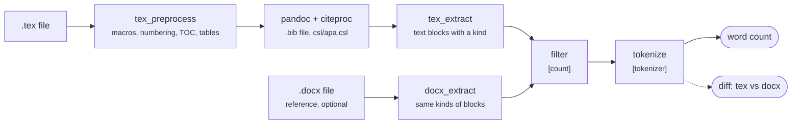

# texwc – Word/LibreOffice-compatible word count for LaTeX

Counts the words in a `.tex` file so that the number matches what LibreOffice Writer (or MS Word) reports for the same document as a `.docx`. In-text citations and the bibliography are rendered from the `.bib` with a CSL style (APA by default). All counting rules are in `wordcount.toml`.

## How it works



**tex-flow**
1. **tex_preprocess**: writes out what LaTeX normally generates (heading numbers, "Figure 1:", TOC, header/footer text) and replaces custom commands like `\guidance` with their visible text.
2. **pandoc + citeproc**: turns the LaTeX into plain text and writes each `\cite` as real text, e.g. "(De Bruijn et al., 2002)", from the `.bib` and the citation style.
3. **tex_extract**: splits the text into blocks and labels each with a kind: heading, paragraph, table, caption, guidance box, TOC, bibliography or header.

**docx-flow** (optional)
1. **docx_extract**: reads the `.docx` into the same kind of labelled blocks, as a benchmark to compare against.

**common-flow**
1. **filter**: uses the `[count]` rules to decide which blocks count, e.g. drop everything after "References" or leave out some kinds.
2. **tokenize**: splits each block into words the way LibreOffice or Word does, e.g. "2026–2027" is 2 words and a lone "•" is 1.
3. **word count**: adds up the words, as a total or per section and per kind.
4. **diff** (dashed line): compares the `.tex` and `.docx` words one by one and shows where they differ, so you know which rule to adjust.

Each text block has a *kind* (`heading`, `para`, `table`, `caption`, `guidance`, `toc`, `bibliography`, `footnote`, `header`). The config uses these kinds to decide what is counted.

To see these stages on a real document, read [`demo/README.md`](demo/README.md). It follows a small `.tex` file through every box of the diagram, using the output of `python3 texwc.py trace`.

## Files

| File | Purpose |
|---|---|
| `texwc.py` | Command-line entry point (`count`, `diff`, `calibrate`, `probe`, `trace`, `setup`) |
| `wordcount.toml` | All rules: input files, tokenizer, what to count, macro expansions, numbering formats |
| `wordcount/tex_preprocess.py` | Rewrites the LaTeX: expands macros, numbers headings and captions, builds the TOC, flattens tables, adds header/footer text |
| `wordcount/tex_extract.py` | Runs pandoc (with citeproc) and turns its output into text blocks |
| `wordcount/docx_extract.py` | Reads a `.docx` into the same kind of text blocks (body, TOC, captions, headers/footers) |
| `wordcount/common.py` | Config loading, tokenizer and filters (shared by both sides) |
| `wordcount/report.py` | Prints the per-section and per-kind counts and the tex-vs-docx diff |
| `wordcount/trace.py` | Writes the output of every stage to a folder (`trace` command) |
| `wordcount/lo_count.py` | Gets a live word count from LibreOffice (used by `calibrate` and `probe`) |
| `wordcount/system.py` | Finds pandoc and LibreOffice for the current OS (`[system]` in the config) |
| `csl/*.csl` | Citation styles: APA (default), IEEE, Chicago, Harvard |
| `demo/` | Walkthrough of the pipeline: `demo.tex`, its `trace/` output and a step-by-step `README.md` |
| `example/` | Example document: `main.tex` + `references.bib`, the benchmark `LCA_PR.docx` and the compiled `LCA_PR.pdf` |

## Install

- Python ≥ 3.11 (no pip packages needed)
- [pandoc](https://pandoc.org) ≥ 3
- Optional, only for `calibrate` and `probe`: LibreOffice and a Python that can `import uno`. On Windows and macOS this Python comes with LibreOffice.

```bash
# Fedora
sudo dnf install pandoc libreoffice-writer libreoffice-pyuno
# Debian/Ubuntu
sudo apt install pandoc libreoffice-writer python3-uno
# Windows (PowerShell); then run the commands below with `py` instead of `python3`
winget install Python.Python.3.13
winget install JohnMacFarlane.Pandoc
winget install TheDocumentFoundation.LibreOffice
```

Then check the installation:

```bash
python3 texwc.py setup
```

The OS is detected automatically, and pandoc and LibreOffice are looked up in their usual places. If something is installed elsewhere, set its path under `[system]` in `wordcount.toml`:

```toml
[system]
platform = "auto"     # or "linux" | "windows" | "macos"
pandoc = ""           # "" = default; e.g. 'C:\Tools\pandoc\pandoc.exe'
soffice = ""          # e.g. 'D:\LibreOffice\program\soffice.exe'
lo_python = ""        # e.g. 'D:\LibreOffice\program\python.exe'
```

## Getting started

The config points at the example in `example/`. It counts the text before the "References" heading (`stop_at_heading` in `wordcount.toml`):

```bash
python3 texwc.py count                     # → 1923 words  (example/main.tex, tokenizer: word)
python3 texwc.py count -s --depth 1        # words per top-level section
python3 texwc.py --until "" count          # the whole document → 2292 words
python3 texwc.py --mode libreoffice count   # LibreOffice count (adds header/footer text) → 1947 words
python3 texwc.py diff                      # check against example/LCA_PR.docx
```

To count your own document, pass its files:

```bash
python3 texwc.py --tex path/to/main.tex count
python3 texwc.py --tex path/to/main.tex --bib path/to/refs.bib count
```

You can leave out `--bib`. The `.bib` is then taken from the `\addbibresource{...}` or `\bibliography{...}` line in the tex. To make it permanent, set `tex` and `bib` under `[input]` in `wordcount.toml`. Paths there are relative to the config file; paths on the command line are relative to the current directory.

To check the count against a `.docx` of the same document, use `diff --docx file.docx`. Any difference is fixed by editing a rule in the config, not the code.

## Commands

| Command | What it does |
|---|---|
| `count` | Total word count. `-s` per section, `-k` per kind, `--dump-tokens FILE` writes every counted word, `-v` lists LaTeX commands that pandoc skipped |
| `count --docx FILE` | Counts a `.docx` with the same rules |
| `diff` | Compares the tex with the reference docx: per section, per kind, then every differing run of words |
| `calibrate` | Prints every count side by side: the stored docx count, a live LibreOffice count, and our counts for both files |
| `trace --out DIR` | Writes the output of every stage to `DIR`: the preprocessed LaTeX and a diff for each step, the pandoc command and AST, the blocks, the filter decisions, the words and the count. With `--docx FILE` it also writes the docx side and the diff. See [`demo/`](demo/README.md) |
| `setup` | Checks Python, pandoc, the input files and LibreOffice, and says how to fix anything missing |
| `probe "text" ...` | Compares LibreOffice's live count of a snippet with our tokenizer, to settle a single rule |

Global options (put them before the command):

| Option | Effect |
|---|---|
| `--tex FILE` | The LaTeX file to count (overrides `[input] tex`) |
| `--bib FILE` | The bibliography (overrides `[input] bib`; default: taken from the tex) |
| `--until HEADING` | Count only the text before that heading (a regex; the heading number is ignored; `""` = everything) |
| `--csl FILE` | Use a different citation style |
| `--mode libreoffice` | Use the LibreOffice tokenizer, which also counts header/footer text (default: `word`, verified against Word on the web) |
| `--config FILE` | Use a different config file |

## Counting rules worth knowing

These rules were verified against LibreOffice 25.8:
- LibreOffice treats en and em dashes as spaces, so `2026–2027` is 2 words.
- Every other piece of text between spaces counts as a word, including `•`, `/`, `&` and `ℹ`.
- LibreOffice counts header and footer text, once per header/footer variant. Word does not.

Checked against Word on the web with `example/LCA_PR.docx`: Word gives 2292 words for the whole document and 1923 for the text before "References" (the default `word` mode gives the same). Word counts exactly like LibreOffice, except that it leaves out the headers and footers. Its en dashes also separate words.
- Heading numbers, caption labels (`Figure 1:`) and the table of contents all count, because they are literal text in a `.docx`.

# Author

This tool is developed by Rud Hansen, co-authored by Claude.

For use in the LCA-PR course at Leiden University. To hopefully allow for the use of Latex documents instead of the word document template.