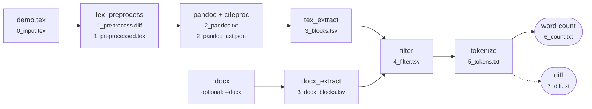

# Demo: one .tex file through every stage

This folder follows a tiny document, [`demo.tex`](demo.tex), through each box of the diagram in the main README. Each counting rule shows up once in the document, and a `%` comment above the line names the rule in `wordcount.toml`.

The output of every stage is already in [`trace/`](trace/), so you can read along without installing anything. To make it again:

```bash
python3 texwc.py --tex demo/demo.tex trace --out demo/trace
```

```
tracing demo/demo.tex → demo/trace/
0 input       38 lines of document body  → 0_input.tex
1 preprocess  steps that changed the text: drop_environments, macros, tables, structure, headers_footers  → 1_preprocess.diff, 1_preprocessed.tex
2 pandoc      17 top-level AST blocks, 0 warnings  → 2_pandoc.txt, 2_pandoc_ast.json
3 extract     24 blocks: toc 4, heading 4, guidance 1, para 3, caption 1, table 6, bibliography 1, header 4  → 3_blocks.tsv
4 filter      kept 22, dropped 2  → 4_filter.tsv
5 tokenize    93 tokens  → 5_tokens.txt
6 count       93 words  → 6_count.txt
```

`trace` works on any document. For example, `python3 texwc.py trace --out trace` traces `example/main.tex`.



---

## 0 · Input → [`0_input.tex`](trace/0_input.tex)

`TexPreprocessor.run` (`wordcount/tex_preprocess.py`) reads the file and inlines `\input`/`\include` files. It strips the comments and splits the preamble from the body. Only the body is passed on.

The preamble is read for the settings that change the visible text. The first line of `1_preprocess.diff` lists them:

```
% read from the preamble: \contentsname = 'Contents', tocdepth = 3, headers = ['LCA Demo -- Word Count'], footers = ['\\thepage']
```

## 1 · tex_preprocess → [`1_preprocess.diff`](trace/1_preprocess.diff), [`1_preprocessed.tex`](trace/1_preprocessed.tex)

LaTeX generates text when it compiles: heading numbers, "Table 1:", the TOC, header text. In a `.docx` this text is typed in, so Word and LibreOffice count it. This stage writes that text out in the source. It also marks special text with `wc<kind>` environments, so later stages know what kind of text it is.

The diff shows the effect of each step in turn:

| Step | Config | Before | After |
|---|---|---|---|
| `drop_environments` | `[tex] drop_environments` | `\begin{comment}…\end{comment}` | *(gone)* |
| `macros` | `[tex.macros]` | `\guidance{Delete this box…}` | `\begin{wcguidance}ℹ Delete this box…\end{wcguidance}` |
| | | `\textbullet\ A lone bullet` | `•\ A lone bullet` |
| `tables` | `[tex.tables]` | `Option & Material \\` | `\begin{wctable}` + one paragraph per cell |
| `structure` | `heading_format` | `\section{Introduction}` | `\section*{1. Introduction}` |
| | `[tex.toc]` | `\tableofcontents` | `\begin{wctoc}` Contents / 1. Introduction 0 / … |
| | `[tex.captions]` | `\caption{Packaging options}` | `\begin{wccaption}Table 1: Packaging options…` |
| | `[tex.refs]` | `\autoref{tab:options}` | `Table 1` |
| | `[tex.bibliography]` | `\printbibliography` | `\section*{References}` + `wcbibliography` placeholder |
| `headers_footers` | `[tex.headers]` | `\fancyhead[L]{LCA Demo -- Word Count}` | two `wcheader` copies (and `\thepage` → `0`) |

Headings become starred (`\section*`) and carry their number as literal text, so pandoc cannot number them a second time.

## 2 · pandoc + citeproc → [`2_pandoc.txt`](trace/2_pandoc.txt), [`2_pandoc_ast.json`](trace/2_pandoc_ast.json)

`run_pandoc` (`wordcount/tex_extract.py`) runs this command:

```
pandoc -f latex -t json --verbose --metadata link-citations=false --citeproc --bibliography demo/demo.bib --csl csl/apa.csl --metadata lang=en-US < 1_preprocessed.tex > 2_pandoc_ast.json
```

Pandoc turns the LaTeX into a syntax tree, as JSON. Citeproc reads `demo.bib` and the CSL style, and writes each citation as the text it will show:

```json
{"t": "Cite", "c": [[{"citationId": "debruijnHandbookLifeCycle2002a", …}],
  [{"t": "Str", "c": "(De"}, {"t": "Space"}, {"t": "Str", "c": "Bruijn"}, {"t": "Space"},
   {"t": "Str", "c": "et"}, {"t": "Space"}, {"t": "Str", "c": "al.,"}, {"t": "Space"}, {"t": "Str", "c": "2002)"}]]}
```

The `wc<kind>` environments become `Div`s with that class, for example `["", ["wcguidance"], []]`. Citeproc adds the reference list at the end as `Div#refs`. `2_pandoc.txt` lists any LaTeX commands that produced no text. Look there first if a count is too low.

## 3 · tex_extract → [`3_blocks.tsv`](trace/3_blocks.tsv)

`AstWalker` walks the tree and writes one text block per paragraph. Each block gets a **kind**, taken from the Div class (`KIND_DIVS`), and the **section** it belongs to. The reference list is moved to where `\printbibliography` was.

```
#   kind          section                                text
0   toc           (front matter)                         Contents
1   toc           (front matter)                         1. Introduction 0
4   heading       1. Introduction                        1. Introduction
5   guidance      1. Introduction                        ℹ Delete this box before submitting.
6   para          1. Introduction                        The study covers 2026–2027 and compares two packaging options. LCA follows ISO standards (De Bruijn et al., 2002). • A lone bullet is a word too.
8   para          1. Introduction > 1.1 Functional unit  The functional unit is MATH of drink. Table 1 lists the options.
9   caption       1. Introduction > 1.1 Functional unit  Table 1: Packaging options
13  table         1. Introduction > 1.1 Functional unit  Glass bottle
18  heading       References                             References
19  bibliography  References                             De Bruijn, H., Van Duin, R., … (2002). Handbook on Life Cycle Assessment …
20  header        (headers/footers)                      LCA Demo – Word Count
```

Inline math became `MATH`, one placeholder word (`[tex] math = "one"`). If any `[[tex.replacements]]` changed a block, the file gets an extra column with the text from before.

## 4 · filter → [`4_filter.tsv`](trace/4_filter.tsv)

`apply_filters` (`wordcount/common.py`) applies the `[count]` rules to every block and records why each one is kept or dropped:

```
#   decision  reason                           words  kind          text
17  KEEP      kept                             8      para          PET has the lower footprint in this example.
18  DROP      after stop heading 'References'         heading       References
19  DROP      after stop heading 'References'         bibliography  De Bruijn, H., Van Duin, R., …
20  KEEP      kept                             4      header        LCA Demo – Word Count
```

`stop_at_heading = "References"` drops everything from the References heading on. Page headers and footers are the exception: they are not part of the text flow, so they are still counted.

## 5 · tokenize → [`5_tokens.txt`](trace/5_tokens.txt)

`Tokenizer` (`wordcount/common.py`) splits each kept block into words the way LibreOffice does. Each `⟦…⟧` is one counted word:

```
## #6 [para] 1. Introduction   (27 words, running total 46)
⟦The⟧ ⟦study⟧ ⟦covers⟧ ⟦2026⟧ ⟦2027⟧ ⟦and⟧ ⟦compares⟧ ⟦two⟧ ⟦packaging⟧ ⟦options.⟧ ⟦LCA⟧ ⟦follows⟧ ⟦ISO⟧ ⟦standards⟧ ⟦(De⟧ ⟦Bruijn⟧ ⟦et⟧ ⟦al.,⟧ ⟦2002).⟧ ⟦•⟧ ⟦A⟧ ⟦lone⟧ ⟦bullet⟧ ⟦is⟧ ⟦a⟧ ⟦word⟧ ⟦too.⟧
```

- `2026–2027` gives `⟦2026⟧ ⟦2027⟧`, because the en dash is in `extra_separators`.
- `•` is a word, because `count_symbol_only_tokens = true`.
- `\ ` became a no-break space (U+00A0), and that still separates words.
- Punctuation stays attached to its word: `⟦(De⟧`, `⟦2002).⟧`.

## 6 · word count → [`6_count.txt`](trace/6_count.txt)

```
Words per section:
      11  (front matter)
      35  1. Introduction
      27    1.1 Functional unit
      10  2. Conclusion
      10  (headers/footers)
Words per kind:
      47  para
      11  toc
      10  header
       8  table
       7  heading
       6  guidance
       4  caption
93 words  (demo/demo.tex, tokenizer: libreoffice)
```

This is the same number that `python3 texwc.py --tex demo/demo.tex count -s -k` prints.

---

## The docx side and the diff (optional)

With `--docx`, `trace` also runs `DocxExtractor` (`wordcount/docx_extract.py`) on a reference `.docx` and writes stages 3–6 for it (`3_docx_blocks.tsv` …). It then compares the two sides word by word in `7_diff.txt`. The demo has no `.docx`, so this example uses the course template:

```bash
python3 texwc.py trace --docx example/LCA_PR.docx --out trace
```

```
3 extract     295 blocks: para 73, table 84, guidance 41, heading 41, toc 42, caption 2, bibliography 2, header 10  → 3_docx_blocks.tsv
…
7 diff        tex 1947 vs docx 1947 (+0)  → 7_diff.txt
```

```
  [content] +0  Abstract  (guidance)
    context: …of Contents in the end (right-click
    tex : →
    docx: 🡪
```

Each differing run is labelled `split` (same characters, split into words differently, so it is a tokenizer rule) or `content` (different text). A `content` run is fixed in `[tex.macros]`, `[tex.replacements]` or the document itself.

## Try it: change a rule and look again

1. In `wordcount.toml`, set `exclude_kinds = ["header"]` under `[tokenizer.libreoffice]`. This is what MS Word does.
2. Run `python3 texwc.py --tex demo/demo.tex trace --out demo/trace` again.
3. In `4_filter.tsv`, rows 20–23 now say `DROP  kind 'header' not counted`, and `6_count.txt` drops from 93 to 83.

Undo the change afterwards. `git diff demo/trace` shows exactly what a rule change does at every stage.
